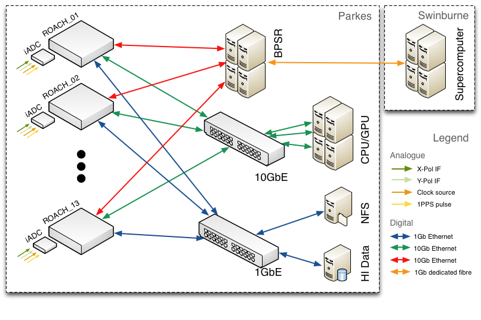

.. HIPSR documentation master file, created by

.. _hardware-chapter:

Hardware
========
This page details the hardware in use in the HIPSR system. HIPSR consists of digitizer
cards; FPGA digital processing boards for "low-level" DSP; a 10GbE switch for data
interconnect; and, a CPU/GPU cluster for "high-level" DSP and data storage.

HIPSR Packetized Architecture
-----------------------------

    
    *Network architecture for HIPSR.*

The HIPSR system may be described as a multi-node DSP `frontend' connected to a multi-node DSP `backend' by a 10Gb Ethernet (10GbE) switch. In the HIPSR system detailed here, DSP tasks are divided between FPGAs and GPGPUs as appropriate. The FPGA based DSP frontend conducts signal processing tasks such as signal filtering and channelization; the GPGPU based DSP backend performs higher-level, moderate- to low- bandwidth DSP such as running pulsar processing pipelines. A diagram of the system archiecture is shown below.

The inclusion of a switch greatly increases the flexibility of the system as data can be dynamically routed between nodes. It does, however, require all data to be packetized along with metadata that describes packet's data payload. Nevertheless, using a switched 10GbE based packetized architecture instead of defining and commissioning a bespoke backplane has drastically decreased development time: all interconnect is off-the-shelf, industry standard, commodity hardware. 

CASPER ROACH boards
-------------------

.. figure:: ROACH_IO.png
    :width: 500px
    :alt: HIPSR Architecture
    :align: center
    
    *Roach Input/Output*

ROACH (Reconfigurable Open Architecture Computing Hardware) is a standalone 
FPGA processing board, developed by the Collaboration for Astronomy Signal Processing
and Electronics Research.

The centrepiece of ROACH is a Xilinx Virtex 5 FPGA (SX95T). 
A separate PowerPC runs Linux and is used to control the board (program the FPGA 
and allow interfacing between the FPGA "software registers/BRAMs/FIFOs" and external
devices using Ethernet).

Two quad data rate (QDR) SRAMs provide high-speed, medium-capacity memory 
(specifically for doing corner-turns), and one DDR2 DIMM provides slower-speed, 
high-capacity buffer memory for the FPGA. The PowerPC has an independent DDR2 DIMM
in order to boot Linux/BORPH.

The two Z-DOK connectors allow ADC, DAC and other interface cards to be attached to the 
FPGA, in the same manner as the IBOB allowed (with backwards compatibility for the ADC 
boards used with the IBOB).

Four CX4 connectors provide a total of 40Gbits/sec bandwidth for connecting ROACH boards
together, or connecting them to other XAUI/10GbE-capable devices (such as 
computers with 10GbE NICs and 10GbE switches).

For more detailed descriptions, see:

* https://casper.berkeley.edu/wiki/Main_Page
* https://casper.berkeley.edu/wiki/ROACH
* https://casper.berkeley.edu/wiki/ROACH_Architecture

iADC digitizer cards
--------------------
Each HIPSR ROACH board is populated with an iADC digitizer card. These cards are
based on the Atmel/e2V AT84AD001B 8-bit Dual 1Gsps ADC:

* http://www.e2v.com/assets/media/files/documents/broadband-data-converters/doc0817I.pdf

More information about the card is available at:

* https://casper.berkeley.edu/wiki/ADC2x1000-8

Cisco switch
------------

The DSP frontend and backend nodes are connected via a 10Gb Ethernet switch. This Cisco 4900M switch is configured with 24 CX4-type ports, 13 of which are connected to the DSP frontend ROACH boards, and 8 of which are connected to the server nodes. The switch allows bi-directional data flow between nodes. The 10GbE switch also has a dedicated 1GbE fibre link to the `Green II supercomputer`_

.. _`Green II supercomputer` : http://astronomy.swin.edu.au/supercomputing/green2/ 
 
at Swinburne University in Melbourne.

All nodes are also connected by 1GbE, through a Cisco 3750 switch. For low bandwidth applications where all of the necessary DSP can be conducted on the FPGA, all data may be read off the 1GbE ports of the ROACH boards. 

=================   =======================================================
Item                  Description
=================   =======================================================
WS-C4900M             CISCO Base system with 8 X2 ports and 2 half slots
S49MIPBK9-15002SG     CISCO Cisco CAT4900M IOS IP BASE SSH 
PWR-C49M-1000AC       CISCO 4900M AC power supply, 1000 watts 
PWR-C49M-1000AC/2     CISCO Redundant AC PS for 4900M 
CAB-AS3112-C15-AU     CISCO AS-3112 to IEC-C15 8ft Aus 
MEM-C4K-FLD128M       CISCO Catalyst 4900M Compact Flash, 128MB Option 
4900M-X2-CVR          CISCO X2 cover on 4900M

WS-X4908-10GE=        CISCO 8 port 2:1 10GbE (X2) line card for 4900M series
                      (this is the expansion module - there are two slots
                      in each chassis)
=================   =======================================================

HIPSR Servers
-------------

Server nodes
~~~~~~~~~~~~

The GPGPU server nodes are bespoke systems, built to specification by Silicon Graphics Pty. Ltd. Each of the 8 server nodes are comprised of:

* dual 2.66 GHz Intel Xeon six-core CPUs, 
* 48 GB DDR3 memory, and 
* dual Nvidia Tesla C2070 GPGPUs. 

While it is intended that a majority of DSP will be conducted on the GPGPUs, the Intel Xeon CPUs may also be used, if required. 

As each server has a single CX4-type 10GbE network interface card (NIC), the input data rate for each server is limited to 10 Gb/s. Given that there are 26 IFs which must be processed by 8 server nodes, the DSP frontend must decrease the data rate of
     
         **2 x 400MHz x 8bit = 6.4 Gb/s**

from each IF from 6.4Gb/s to about 3.0Gb/s.

hipsr-srv0
~~~~~~~~~~

In addition to the GPGPU server nodes, there is a server which provides monitor and control for the DSP frontend, and provides data storage. This server has:

* a 2.4 GHz Intel Xeon four-core CPU,  
* 24 GB DDR3 memory,
* 5TB RAID HDD

As it is not used for DSP, it does not have a GPGPU. This server runs a DHCP daemon and provides a network file system (NFS) to the ROACH boards.

Cabling 
-------

In March 2012, the HIPSR hardware was installed into RFI shielded racks R and S, located on the second floor of the Parkes 64m telescope building (this room lies underneath the telescope dish). 

* A set of BNC cables were laid under the floor from the existing multibeam IF distribution panel to BNC feedthroughs installed on the racks. 
* Another set of cables connect the BNC feedthrough to the SMA input of the iADC cards. 
* A third set of cables connects the 1PPS input of the iADC to a PPS distribution unit, and a clock signal is distributed to each board by a fourth set of SMA cables. 

Each server node and ROACH board is connected to a 1GbE switch by an Ethernet cable (CAT-5E STP). Similarly, each server node and ROACH is connected to a 10GbE switch via CX4 type cables.